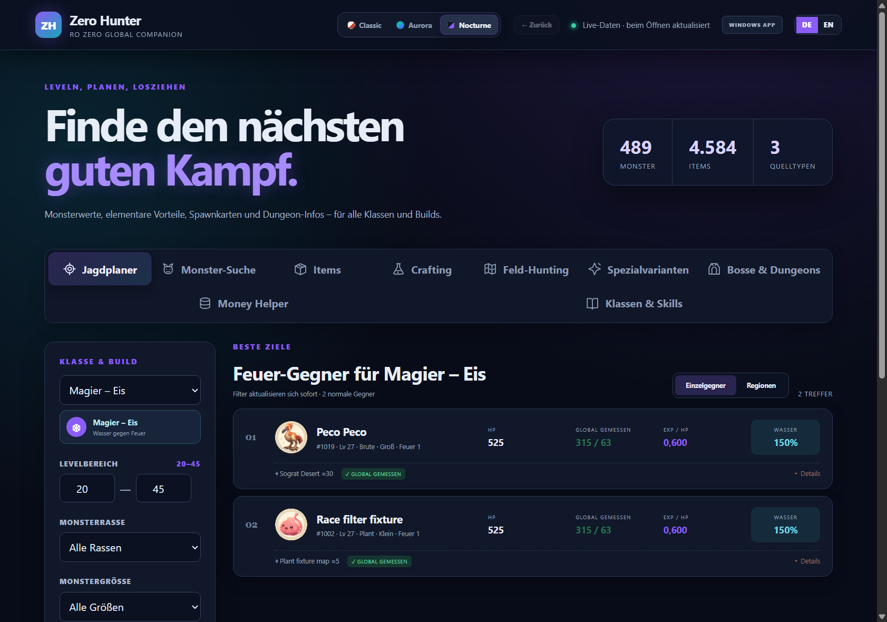

# Odin’s Glasses

Odin’s Glasses is an unofficial Windows companion for Ragnarok Online Zero Global.
It combines a hunt planner, monster and item search, field and dungeon guidance,
NPC-only money estimates, crafting references, and a class and skill guide in a
local Electron application. The interface supports German and English as well
as Classic, Aurora, and Nocturne themes.

[Download the latest Windows installer or portable build](https://github.com/sirelsworth-media/odins-glasses/releases/latest)

An offline-capable Android companion is in alpha development. See
[the Android build notes](docs/ANDROID.md) for its scope and build process.



## Current scope

- Hunt targets by level, element, race, size, EXP efficiency, and NPC drop value
- Region suggestions based on known monster spawns
- Monster, item, field, dungeon, boss, crafting, class, and skill information
- NPC sale values only; player-market prices are deliberately excluded
- Clear distinction between Zero Global measurements and reference data
- Persistent last-good data cache with background refresh

Odin’s Glasses does not control the game client and does not require a ChatGPT
account. Internet access is needed for the first data download. Later starts can
use the locally stored last-good dataset.

## Development

Desktop requirements: Windows x64 and a current Node.js release with npm. The
Android workflow supplies its own Java and Android SDK environment.

```powershell
npm ci
npm run verify
npm run test:ui
npm start
```

`npm run test:performance` runs the deterministic Electron performance check.
`npm run dist` creates the Windows installer and portable package.

## Data and licensing

The source code is licensed under GPL-3.0-or-later. Project-created illustrations
are offered under CC BY 4.0 to the extent described in
[ASSET-LICENSES.md](ASSET-LICENSES.md). Runtime data comes from the openly reusable
RagnaDex API; selected reference sources from rAthena remain under GPL-3.0-or-later.

Read [THIRD_PARTY_NOTICES.md](THIRD_PARTY_NOTICES.md) and
[SOURCE.md](SOURCE.md) before redistributing builds or data. Original Ragnarok
sprites, private source collections, player-market data, and the private birthday
edition are not part of the public repository.

Ragnarok Online and related names, characters, and game content belong to their
respective rights holders. Odin’s Glasses is not affiliated with Gravity, Gravity
Game Unite, RagnaDex, or rAthena.

## Contributing

Contributions are welcome when their source and verification status are clear.
See [CONTRIBUTING.md](CONTRIBUTING.md) for the data and artwork rules.
